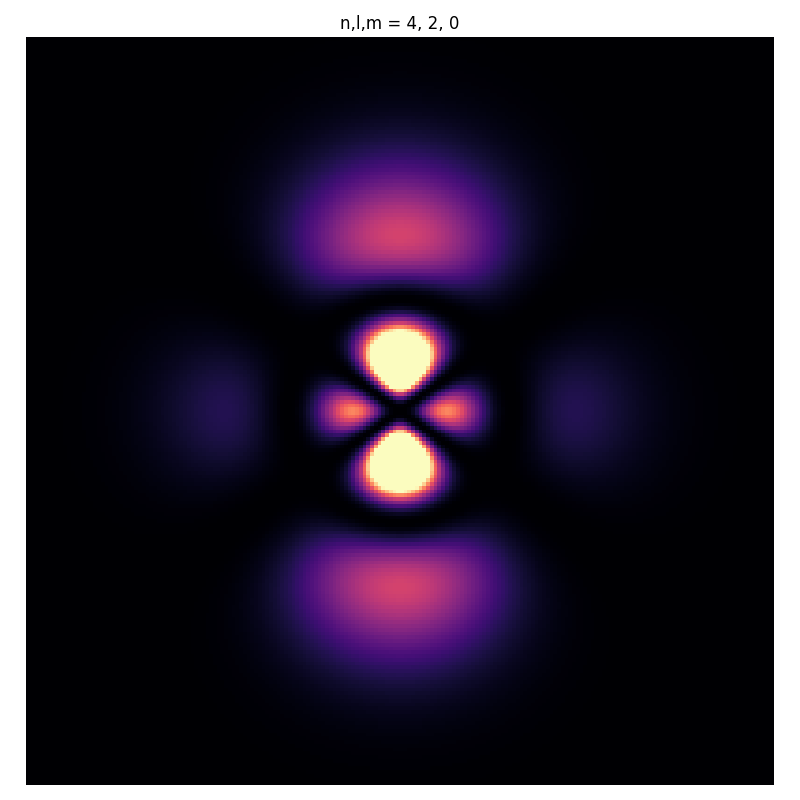
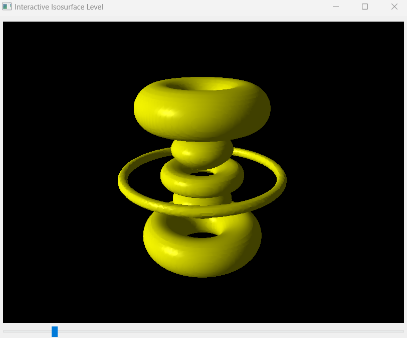

**These two programs compute the eigenstate of the hydrogen atom for any quantum state $(n,l,m)$ and plot the probability density.**

The 2D program does not consider the $\phi$ component of the spherical harmonic function, so it plots a slice of the probability density.

The 3D program plots the isosurface of the probability density using the Vispy library. You can adjust the isosurface level with a cursor to better appreciate the 3D structure.
Vispy is a high-performance interactive 2D/3D data visualization library that uses the GPU for rendering.

